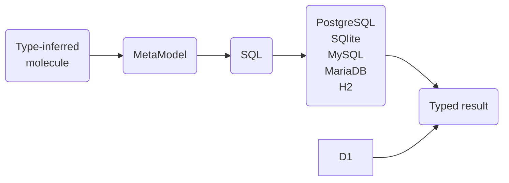

# How does it work?


## Compile Project

When you have configured your sbt project, you can compile it to have Molecule boilerplate code generated:

```
sbt clean compile -Dmolecule=true
```

During project compilation, a series of operations are then performed:

1. Boilerplate source code files based on your domain structure are generated.
2. Generated source code is compiled.
3. Sources and classes are packaged into two `jar`s in the `lib` directory.
4. Generated source code and compiled classes are removed.


In our [basic sample project](https://github.com/scalamolecule/molecule-samples/tree/main/molecule-basic) these two jars are created:

[//]: # (![]&#40;/img/page/setup/setup3.png&#41;)

`dsl` contains the generated Molecule boilerplate code for the defined Person domain structure. The name of each jar (one for compiled classes, one for source code) has "molecule-" prepended to your project name to avoid name clashes in `lib`.

Whenever you make changes to your domain structure, you can simply `sbt compile -Dmolecule=true` and have your Schema transaction boilerplate code re-generated with your latest changes.


## example

We could for instance build a molecule to fetch a list of `name` and `age` of persons in a database:


```scala
Person.name.age.query.get
```


Molecule then translates the molecule to a query for the selected database, like for SQL:

```sql
SELECT DISTINCT
  Person.name,
  Person.age
FROM Person
WHERE
  Person.name IS NOT NULL AND
  Person.age  IS NOT NULL;
```


Molecule internally:

1) Builds a MetaModel of the molecule
2) Produce a query for the chosen database
3) Query the database
4) Returns a typed result




::: code-tabs#coord
@tab Sync
```scala
import molecule.db.postgres.sync.*
       
val persons: List[(String, Int)] = 
  Person.name.age.query.get
```

@tab Async
```scala
import molecule.db.postgres.async.*

val persons: Future[List[(String, Int)]] = 
  Person.name.age.query.get
```

@tab ZIO
```scala
import molecule.db.postgres.zio.*

val persons: ZIO[Conn, MoleculeError, List[(String, Int)]] = 
  Person.name.age.query.get
```

@tab IO
```scala
import molecule.db.postgres.io.* 

val persons: cats.effect.IO[List[(String, Int)]] = 
  Person.name.age.query.get
```
:::


[How does it work](/database/developer/how-doew-it-work) shows how Molecule internally transform

To see how Molecule internally transform the molecule, see [How does it work](/database/developer/how-doew-it-work).


Molecule then translates the molecule to a query for the selected database, like for SQL:

```sql
SELECT DISTINCT
  Person.name,
  Person.age
FROM Person
WHERE
  Person.name IS NOT NULL AND
  Person.age  IS NOT NULL;
```
The query is sent to the database and a typed result returned in one of four API wrappings:

::: code-tabs#api
@tab Sync

```scala
List(
  ("Bob", 42),
  ("Liz", 38)
)
```

@tab Async

```scala
Future(
  List(
    ("Bob", 42),
    ("Liz", 38)
  )
)
```

@tab ZIO

```scala
ZIO.succed(
  List(
    ("Bob", 42),
    ("Liz", 38)
  )
)
```

@tab IO

```scala
IO(
  List(
    ("Bob", 42),
    ("Liz", 38)
  )
)
```
:::

_(In the following examples we'll just show the synchronous result for brevity)_


See [setup](/database/setup) on how to choose a database and API.

[//]: # (#### Namespaces and Attributes)


[//]: # (> [!note])
> `Person` is in Molecule called an "Entity" that encapsulates "Attributes".
>
> For SQL databases Entity/Attribute correspond to Table/Columns. 