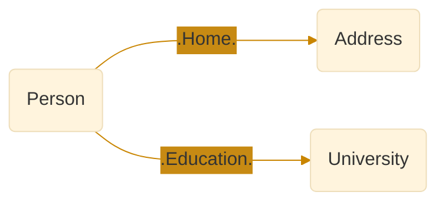
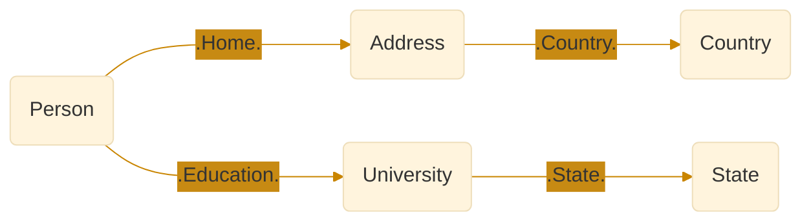
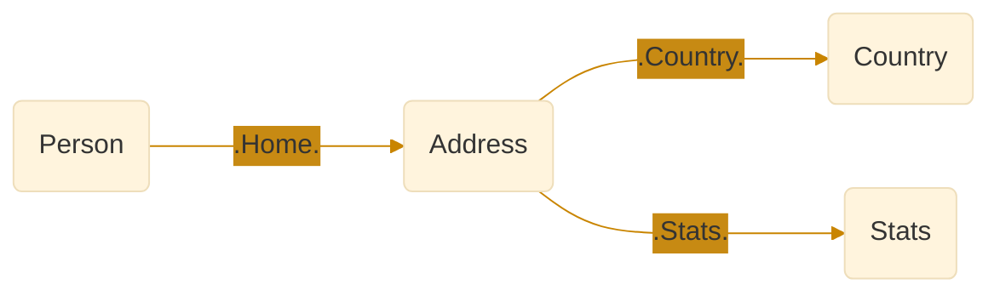
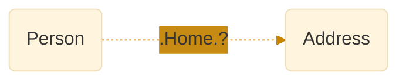
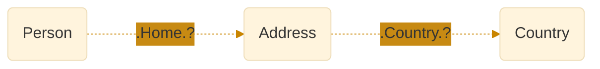
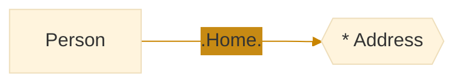

# Relationships


Most databases return flat rows for both cardinality-one and -many relationships. 

Molecule can return hierarchical cardinality-many data which is more natural and easy to work with. 

Let's first look at flat cardinality-one relationships:


## Ref

Molecule uses the word "ref" for cardinality-one relationship between two namespaces (Tables) since we have a reference from namespace A to B.


In our Data Model we give the ref a name, like "home" to describe the relationship:

[//]: # (```mermaid)

[//]: # (%%{)

[//]: # (  init: {)

[//]: # (    'theme': 'base',)

[//]: # (    'themeVariables': {)

[//]: # (      'lineColor': '#c98500',)

[//]: # (      'secondaryColor': '#c78a13',)

[//]: # (      'tertiaryColor': '#fff')

[//]: # (    })

[//]: # (  })

[//]: # (}%%)

[//]: # (flowchart LR)

[//]: # (    A&#40;Person&#41;-- .Home. --->B&#40;Address&#41;)

[//]: # (```)

```scala
trait Person:
  val name = oneString
  val age  = oneInt
  val home = one[Address]

trait Address:
  val street = oneString
  val zip    = oneInt
```


We can then save Bob and his home address:

```scala
Person.name("Bob").age(42)
  .Home.street("Main st. 17").zip(10240).save.transact
```

"home" is capitalized when we transact and query the relationship.

```scala
Person.name.age.Home.street.zip.query.get.head ==> 
  ("Bob", 42, "Main st. 17", 10240) 
```

But we can also retrieve the "ref attribute" or the "ref id" as a value with the lowercase name:
```scala
Person.name.age.home.query.get.head ==> 
  ("Bob", 42, 1L) 
```
When we use the lowercase ref attribute we can't continue building into the `Address` namespace as before. 

But we can get both if we add the special `id` attribute to `Home`:
```scala
Person.name.age.Home.id.street.zip.query.get.head ==> 
  ("Bob", 42, 1L, "Main st. 17", 10240) 
```

We can continue to add refs:

[//]: # (```mermaid)

[//]: # (%%{)

[//]: # (  init: {)

[//]: # (    'theme': 'base',)

[//]: # (    'themeVariables': {)

[//]: # (      'lineColor': '#c98500',)

[//]: # (      'secondaryColor': '#c78a13',)

[//]: # (      'tertiaryColor': '#fff')

[//]: # (    })

[//]: # (  })

[//]: # (}%%)

[//]: # (flowchart LR)

[//]: # (    A&#40;Person&#41; -- .Home. ---> B&#40;Address&#41; -- .Country. ---> C&#40;Country&#41;)

[//]: # (```)

```scala
Person.name.age.Home.street.zip.Country.name.query.get.head ==>
  ("Bob", 42, "Main st. 17", 10240, "USA")

// or
Person.name.age.
  Home.street.zip.
  Country.name.query.get.head ==>
  ("Bob", 42, "Main st. 17", 10240, "USA")
```


## Backref

Sometimes we want to reference multiple namespaces from a previous namespace to get information from multiple sources in one query. 

We can then use a "back ref" to "get back" to the previous namespace in order to make a new ref from there. Each branch of the relationship graph is independent. Here are some examples:



```scala
Person.name.age.
  Home.street.zip._Person. // backref to Person
  Education.shortName. // Education is a ref from Person
  query.get.head ==>
  ("Bob", 42, "Main st. 17", 10240, "Havard")
```

[//]: # (<br>)

[//]: # (<br>)

[//]: # ()

Note that we need to use the original namespace name `_Address` as back ref, not `_Home`:
```scala
Person.name.age.
  Home.street.zip.
  Country.name._Address._Person. // 2 backrefs to Person
  Education.shortName.State.abbr
  .query.get.head ==>
  ("Bob", 42, "Main st. 17", 10240, "USA", "Havard", "MA")
```


[//]: # (<br>)

[//]: # (<br>)

[//]: # ()


```scala
Person.name.age.
  Home.street.zip.
  Country.name._Address.
  Stats.crimeRate
  .query.get.head ==>
  ("Bob", 42, "Main st. 17", 10240, "USA", "Low")
```
As you can see, we can easily model complex relationships and retrieve data through multiple relationships.


## Opt ref

A cardinality-one relationship can also be optional, like a `LEFT JOIN` in SQL.



We initiate the optional relationship with `<Ref>.?` and then use the ref `<Namespace>` inside parentheses to pick the attributes we are interested in. The data of the inside molecule is returned in an `Option`:

```scala
// One optional related attribute 
Person.name.age.Home.?(Address.street).query.get.head ==> List(
  ("Bob", 42, Some("Main st. 17")), // Option[<value>]
  ("Liz", 38, None)
)

// Multiple optional related attributes
Person.name.age.Home.?(Address.street.zip).query.get.head ==> List(
  ("Bob", 42, Some(("Main st. 17", 10240))), // Option[<tuple>]
  ("Liz", 38, None)
)
```

### Adjacent


### Nested

We can even nest optional refs





```scala
// One optional related attribute 
Person.name.age
  .Home.?(Address.street
    .Country.?(Country.name)).query.get.head ==> List(
  ("Bob", 42, Some("Main st. 17")), // Option[<value>]
  ("Liz", 38, None)
)

// Multiple optional related attributes
Person.name.age
  .Home.?(Address.street.zip
    .Country.?(Country.name)).query.get.head ==> List(
  ("Bob", 42, Some(("Main st. 17", 10240))), // Option[<tuple>]
  ("Liz", 38, None)
)
```

## Nested




For cardinality-many relationships this is annoying since data for the initial Namespace will be repeated redundantly for each sub namespace. And you'll have to extract the natural hierarchical structure yourself, unless the database system lets you map the data to a matching class hierarchy that you already have - which is again rather inflexible.


## Opt nested


[//]: # (```scala)

[//]: # (val intAttr       = oneInt.validate&#40;_ > 2&#41;)

[//]: # (val localDateAttr = oneLocalDate)

[//]: # (  .validate&#40;_.compareTo&#40;LocalDate.of&#40;2002, 1, 1&#41;&#41; > 0&#41;)

[//]: # (// etc for all primitive types)

[//]: # (```)
