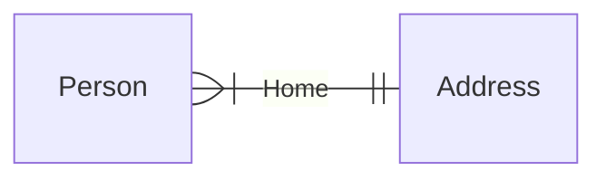
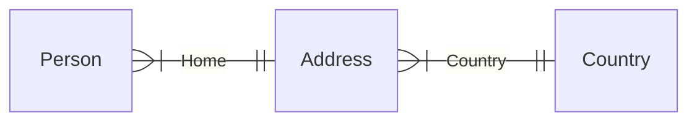
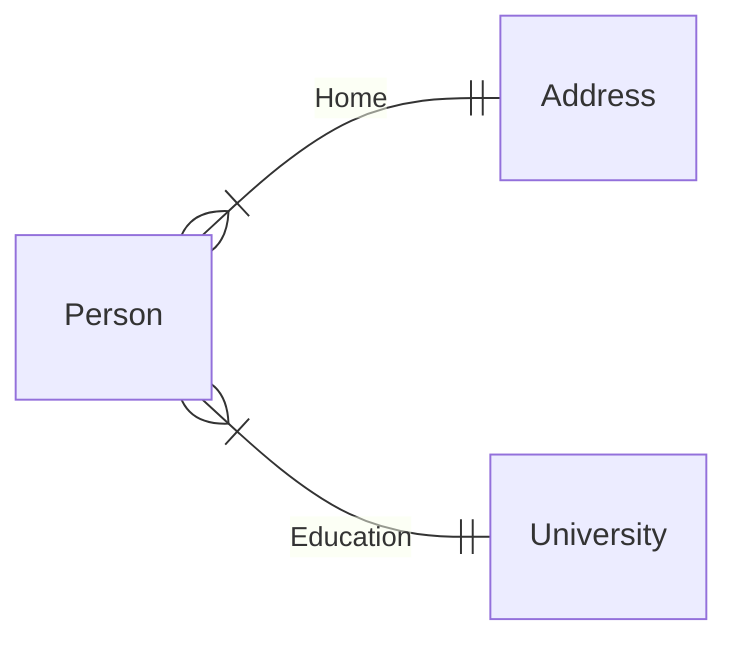
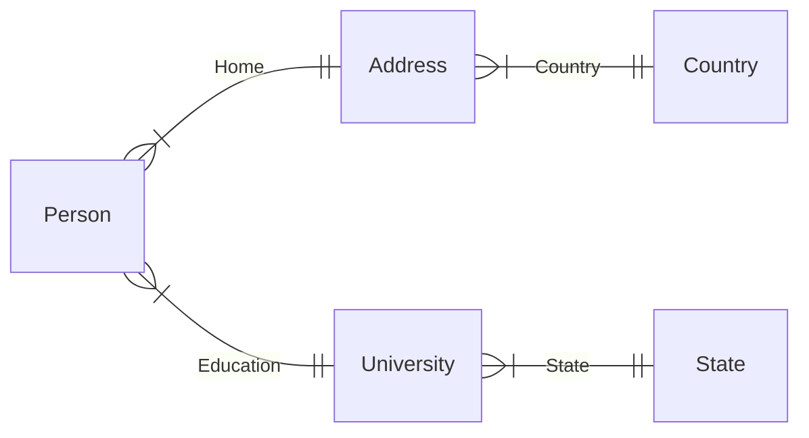
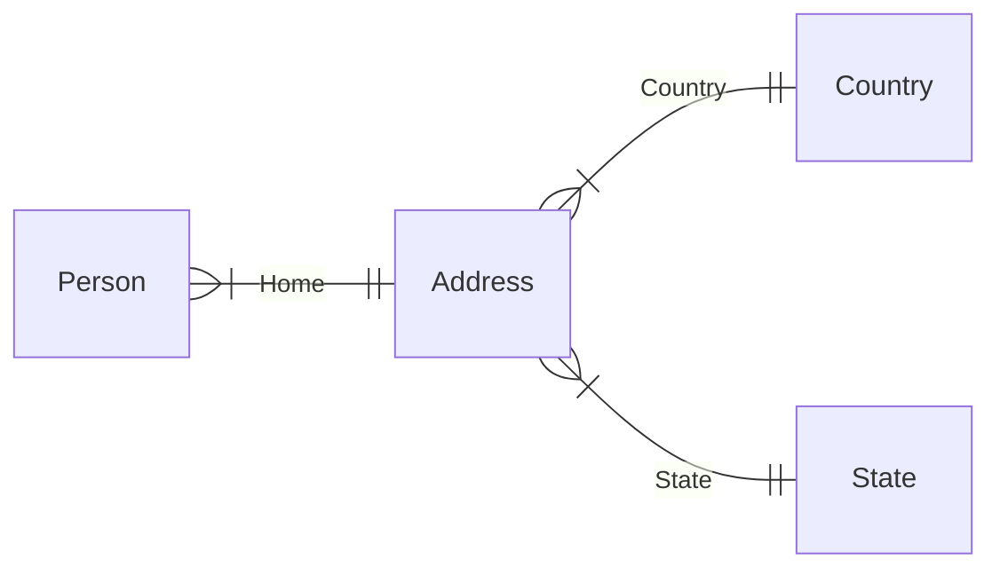
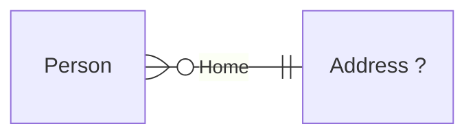
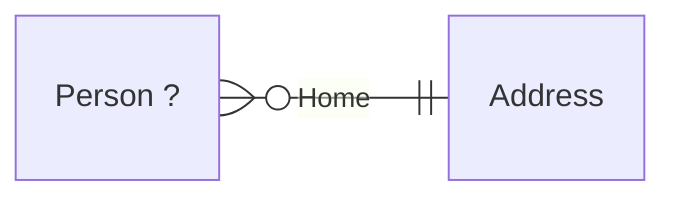

# Many-to-one

Relationships in Molecule are defined with a foreign key attribute pointing to a related entity.  

With a `home` relationship defined from `Person` to `Address`:

```scala
trait Person:
  val name = oneString
  val age  = oneInt
  val home = manyToOne[Address] // foreign key

trait Address:
  val street = oneString
  val zip    = oneInt
```

we can query for the name, age and home address of Persons in the database:

::: code-tabs
@tab Molecule
```scala
Person.name.age.Home.street.zip.query.get ==> List(
  ("Bob", 42, "DoobieSetup2 st. 17", 10240),
  ("Liz", 38, "DoobieSetup2 st. 17", 10240),
  ("Jon", 50, "Beach road", 11750),
)
```
@tab SQL
```sql
SELECT DISTINCT
  Person.name,
  Person.age,
  Address.street,
  Address.zip
FROM Person
  INNER JOIN Address ON Person.home = Address.id
WHERE
  Person.name    IS NOT NULL AND
  Person.age     IS NOT NULL AND
  Address.street IS NOT NULL AND
  Address.zip    IS NOT NULL;
```
:::

As you can see, multiple Persons can share the same Address which is the nature of a many-to-one relationship:


In the database, the foreign key `home` of both Bob and Liz's rows point to the same Address id.

::: info
Relationships are by default mandatory in Molecule, meaning that the above molecule translates to an inner join in SQL and not a left join. 

That's also why the relationship from Person to Address in the ER diagram above starts with "one or more" notation and not "zero or more".

See below for [optional relational data]("optional). 
:::

## Chain relationships

Chain multiple relationships by adding more relationship accessors like `Country`:

::: code-tabs
@tab Molecule
```scala
Person.name.age.Home.street.zip.Country.name.query.get.head ==>
  ("Bob", 42, "DoobieSetup2 st. 17", 10240, "USA")
```
@tab SQL
```sql
SELECT DISTINCT
  Person.name,
  Person.age,
  Address.street,
  Address.zip,
  Country.name
FROM Person
  INNER JOIN Address ON Person.home = Address.id
  INNER JOIN Country ON Address.country = Country.id
WHERE
  Person.name    IS NOT NULL AND
  Person.age     IS NOT NULL AND
  Address.street IS NOT NULL AND
  Address.zip    IS NOT NULL AND
  Country.name   IS NOT NULL;
```
:::




We don't necessarily have to return data from deeply related entities. We could for instance just return name, age and home Address of Persons in the US:

::: code-tabs
@tab Molecule
```scala
// Tacit Country name_
Person.name.age.Home.street.zip.Country.name_("USA").query.get.head ==>
  ("Bob", 42, "DoobieSetup2 st. 17", 10240)
```
@tab SQL
```sql
SELECT DISTINCT
  Person.name,
  Person.age,
  Address.street,
  Address.zip
FROM Person
  INNER JOIN Address ON Person.home = Address.id
  INNER JOIN Country ON Address.country = Country.id
WHERE
  Person.name    IS NOT NULL AND
  Person.age     IS NOT NULL AND
  Address.street IS NOT NULL AND
  Address.zip    IS NOT NULL AND
  Country.name   = 'USA';
```
:::


## Stepping back

Sometimes we want to get data from multiple related entities in one query. We can do this by "stepping back" to the previous entity and relate to another entity from there, like a new branch in a graph.

We might want to get both Address and University data for Persons along their names and ages:




The underscore-prefixed entity name `_Person` brings us back to the `Person` entity so that we can create a new relationship/branch from there:

::: code-tabs
@tab Molecule
```scala
Person.name.age
  .Home.street.zip // branch 1
  ._Person // step back to Person
  .Education.shortName // branch 2
  .query.get.head ==>
  (
    "Bob", 42,
    "DoobieSetup2 st. 17", 10240, // branch 1 data 
    "Harvard" // branch 2 data
  )
```
@tab SQL
```sql
SELECT DISTINCT
  Person.name,
  Person.age,
  Address.street,
  Address.zip,
  University.shortName
FROM Person
  INNER JOIN Address    ON Person.home = Address.id
  INNER JOIN University ON Person.education = University.id
WHERE
  Person.name          IS NOT NULL AND
  Person.age           IS NOT NULL AND
  Address.street       IS NOT NULL AND
  Address.zip          IS NOT NULL AND
  University.shortName IS NOT NULL;
```
:::

### Multiple steps back

Let's relate twice in one branch of the relationship graph and then step back twice to get back to `Person` so that we can reach `Education` and `State` in a second branch:




::: code-tabs
@tab Molecule
```scala
Person.name.age
  .Home.street.zip.Country.name // branch 1
  ._Address._Person // two steps back to Person
  .Education.shortName.State.abbr // branch 2
  .query.get.head ==>
  (
    "Bob", 42,
    "DoobieSetup2 st. 17", 10240, "USA", // branch 1 data 
    "Harvard", "MA" // branch 2 data
  )
```
@tab SQL
```sql
SELECT DISTINCT
  Person.name,
  Person.age,
  Address.street,
  Address.zip,
  Country.name,
  University.shortName,
  State.abbr
FROM Person
  INNER JOIN Address    ON Person.home = Address.id
  INNER JOIN Country    ON Address.country = Country.id
  INNER JOIN University ON Person.education = University.id
  INNER JOIN State      ON University.state = State.id
WHERE
  Person.name          IS NOT NULL AND
  Person.age           IS NOT NULL AND
  Address.street       IS NOT NULL AND
  Address.zip          IS NOT NULL AND
  Country.name         IS NOT NULL AND
  University.shortName IS NOT NULL AND
  State.abbr           IS NOT NULL;
```
:::

Note that we use the original entity name `_Address` as a back step, not `_Home`:

### Sub-branches 

We can also branch out from intermediary entities:



::: code-tabs
@tab Molecule
```scala
Person.name.age
  .Home.street.zip.Country.name // branch 1
  ._Address // one step back to Address
  .Stats.crimeRate // branch 2
  .query.get.head ==>
  (
    "Bob", 42,
    "DoobieSetup2 st. 17", 10240, "USA", // branch 1 data 
    "Low" // branch 2 data
  )
```
@tab SQL
```sql
SELECT DISTINCT
  Person.name,
  Person.age,
  Address.street,
  Address.zip,
  Country.name,
  Stats.crimeRate
FROM Person
  INNER JOIN Address ON Person.home = Address.id
  INNER JOIN Country ON Address.country = Country.id
  INNER JOIN Stats   ON Address.stats = Stats.id
WHERE
  Person.name     IS NOT NULL AND
  Person.age      IS NOT NULL AND
  Address.street  IS NOT NULL AND
  Address.zip     IS NOT NULL AND
  Country.name    IS NOT NULL AND
  Stats.crimeRate IS NOT NULL;
```
:::

As you can see, we can easily model complex relationships and retrieve data through multiple relationships.


## Optional relationship

A many-to-one relationship can also _optional_, as a `LEFT JOIN` in SQL. We can illustrate this with the "zero or more" outgoing edges from Person:



We initiate the optional relationship with `Home.?(...)` and then build an "inner molecule" from `Address` within the parentheses to pick the attributes we are interested in. The data of the inside molecule is returned in an `Option`:

::: code-tabs
@tab Molecule
```scala
Person.name.age.Home.?(Address.street).query.get ==> List(
  ("Bob", 42, Some("DoobieSetup2 st. 17")), // Option[<value>]
  ("Liz", 38, None) // Liz has no home address saved
)
```
@tab SQL
```sql
SELECT DISTINCT
  Person.name,
  Person.age,
  Address.street
FROM Person
  LEFT JOIN Address ON Person.home = Address.id
WHERE
  Person.name IS NOT NULL AND
  Person.age  IS NOT NULL;
```
:::

or with multiple optionally related attributes:

::: code-tabs
@tab Molecule
```scala
Person.name.age.Home.?(Address.street.zip).query.get ==> List(
  ("Bob", 42, Some(("DoobieSetup2 st. 17", 10240))), // Option[<tuple>]
  ("Liz", 38, None)
)
```
@tab SQL
```sql
SELECT DISTINCT
  Person.name,
  Person.age,
  Address.street,
  Address.zip
FROM Person
  LEFT JOIN Address ON Person.home = Address.id
WHERE
  Person.name IS NOT NULL AND
  Person.age  IS NOT NULL;
```
:::

## Optional entity

A many-to-one relationship can also start from an _optional entity_, like a `RIGHT JOIN` in SQL. And we still illustrate this with the "zero or more" outgoing edges from Person:



Now we start an optional entity `Person.?(...)` and then build an "inner molecule" from `Person` within the parentheses. Attributes of the initial entity `Person` are then returned as an option:

::: code-tabs
@tab Molecule
```scala
Person.?(Person.name).Home.street.query.get ==> List(
  (None, "Lonely st. 1"), // No-one lives on Lonely st.
  (Some("Bob"), "DoobieSetup2 st. 17"),
)
```
@tab SQL
```sql
SELECT DISTINCT
  Person.name,
  Address.street
FROM Person
  RIGHT JOIN Address ON
    Person.home = Address.id AND
    Person.name IS NOT NULL AND
    Address.street IS NOT NULL;
```
:::

And with multiple optional initial attributes:

::: code-tabs
@tab Molecule
```scala
Person.?(Person.name.age).Home.street.query.i.get ==> List(
  (None, "Lonely st. 1"),
  (Some(("Bob", 42)), "DoobieSetup2 st. 17"),
)
```
@tab SQL
```sql
SELECT DISTINCT
  Person.name,
  Person.age,
  Address.street
FROM Person
  RIGHT JOIN Address ON
    Person.home = Address.id AND
    Person.name IS NOT NULL AND
    Person.age IS NOT NULL AND
    Address.street IS NOT NULL;
```
:::


## Optional-mandatory

You can mix mandatory and optional many-to-one relationships in Molecule in certain ways:

Mandatory relationship _before_ optional relationship is allowed:

::: code-tabs
@tab Molecule
```scala
Person.name.age
  .Home.street.zip //                           Person --- Home
  ._Person.Education.?(University.shortName) // Person -?- Education
  .query.get ==> List(
  (
    "Bob", 42,
    "DoobieSetup2 st. 17", 10240,
    Some("Harvard"),
  )
  // (Liz not included since home address is mandatory)
)
```
@tab SQL
```sql
SELECT DISTINCT
  Person.name,
  Person.age,
  Address.street,
  Address.zip,
  University.shortName
FROM Person
  INNER JOIN Address   ON Person.home = Address.id
  LEFT JOIN University ON Person.education = University.id
WHERE
  Person.name    IS NOT NULL AND
  Person.age     IS NOT NULL AND
  Address.street IS NOT NULL AND
  Address.zip    IS NOT NULL;
```
:::


Mandatory relationship **_after_** optional relationship is **_not_** allowed:

```scala
intercept[ModelError] {
  Person.name.age
    .Home.?(Address.street.zip) // Person -?- Home
    .Education.shortName //        Person --- Education
    .query.get ==> List(
    (
      "Bob", 42,
      Some(("DoobieSetup2 st. 17", 10240)),
      Some("Harvard"),
    ),
    (
      "Liz", 38,
      None,
      None
    )
  )
}.msg ==> "Only further optional refs allowed after optional ref."
```

## Optional-optional

Adjacent optional relationship is allowed. Note how it is presumed that each optional relationship starts from `Person` (so we don't need to step back with `_Person` in this case)

::: code-tabs
@tab Molecule
```scala
Person.name.age
  .Home.?(Address.street.zip) //        Person -?- Home
  .Education.?(University.shortName) // Person -?- Education
  .query.get ==> List(
  (
    "Bob", 42,
    Some(("DoobieSetup2 st. 17", 10240)),
    Some("Harvard"),
  ),
  (
    "Liz", 38,
    None,
    None
  )
)
```
@tab SQL
```sql
SELECT DISTINCT
  Person.name,
  Person.age,
  Address.street,
  Address.zip,
  University.shortName
FROM Person
  LEFT JOIN Address    ON Person.home = Address.id
  LEFT JOIN University ON Person.education = University.id
WHERE
  Person.name IS NOT NULL AND
  Person.age  IS NOT NULL;
```
:::


## Optional(mandatory)

Mandatory relationship (`Country`) on inside optional relationship molecule is allowed:

::: code-tabs
@tab Molecule
```scala
Person.name.age
  .Home.?(Address.street.Country.name).query.get ==> List(
  ("Bob", 42, Some(("DoobieSetup2 st. 17", "USA"))),
  ("Liz", 38, None)
)
```
@tab SQL
```sql
SELECT DISTINCT
  Person.name,
  Person.age,
  Address.street,
  Country.name
FROM Person
  LEFT JOIN Address ON Person.home = Address.id
  LEFT JOIN Country ON Address.country = Country.id
WHERE
  Person.name IS NOT NULL AND
  Person.age  IS NOT NULL;
```
:::


## Optional(optional)

And we can even have optional relationships inside an optional relationship:

::: code-tabs
@tab Molecule
```scala
Person.name.age
  .Home.?(Address.street.zip
    .Country.?(Country.name)).query.get ==> List(

  ("Bob", 42, Some(
    ("DoobieSetup2 st. 17", 10240, Some(
      "USA")))),

  ("Liz", 38, None)
)
```
@tab SQL
```sql
SELECT DISTINCT
  Person.name,
  Person.age,
  Address.street,
  Address.zip,
  Country.name
FROM Person
  LEFT JOIN Address ON Person.home = Address.id
  LEFT JOIN Country ON Address.country = Country.id
WHERE
  Person.name IS NOT NULL AND
  Person.age  IS NOT NULL;
```
:::


##### [<i class="fas fa-handshake" style="margin-right: 4px;"></i> Relationship compliance tests](https://github.com/scalamolecule/molecule/tree/main/db/compliance/shared/src/test/scala/molecule/db/compliance/test/relation)