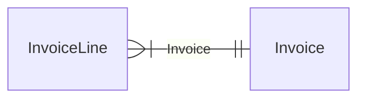
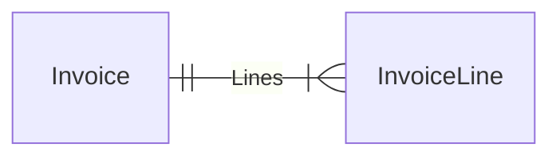

# One-to-many

As described in [Domain structure](/database/setup/domain-structure#one-to-many), relationships are always only defined as many-to-one relationships with a foreign key on the many-side pointing to the one-side.

But often we want to query in the other direction with a one-to-many relationship, and Molecule supports this too.

So, when we define a foreign key from `InvoiceLine` to `Invoice`,

```scala
trait InvoiceLine:
  val invoice = manyToOne[Invoice].oneToMany("Lines")
```
then we can both use `Invoice` to query the many-to-one relationship from `InvoiceLine` to `Invoice`:



::: code-tabs
@tab Molecule
```scala
InvoiceLine.product.Invoice.no.query.get ==> List(
  ("Chocolate", 2),
  ("Coffee", 1),
  ("Milk", 1),
  ("Tea", 1),
  ("Tea", 2),
)
```
@tab SQL
```sql
SELECT DISTINCT
  InvoiceLine.product,
  Invoice.no
FROM InvoiceLine
  INNER JOIN Invoice ON InvoiceLine.invoice = Invoice.id
WHERE
  InvoiceLine.product IS NOT NULL AND
  Invoice.no          IS NOT NULL;
```
:::

and also the one-to-many relationship accesor `Lines` relating from `Invoice` to `InvoiceLines`:




::: code-tabs
@tab Molecule
```scala
Invoice.no.Lines.product.query.get ==> List(
  (1, "Coffee"),
  (1, "Milk"),
  (1, "Tea"),
  (2, "Chocolate"),
  (2, "Tea"),
)
```
@tab SQL
```sql
SELECT DISTINCT
  Invoice.no,
  InvoiceLine.product
FROM Invoice
  INNER JOIN InvoiceLine ON Invoice.id = InvoiceLine.invoice
WHERE
  Invoice.no          IS NOT NULL AND
  InvoiceLine.product IS NOT NULL;
```
:::

In both these directions we get "flat" rows of data. And the one-side, the `Invoice` data is redundantly repeated for each invoice. We'd like to avoid that...


## Nested

Molecule can turn flat rows into non-redundant nested data with the nested accessor `*` often associated with "many", as in "Invoice with many lines":

::: code-tabs
@tab Molecule
```scala
Invoice.no.Lines.*(InvoiceLine.product).query.i.get ==> List(
  (1, List("Coffee", "Milk", "Tea")),
  (2, List("Chocolate", "Tea")),
)
```
@tab SQL
```sql
SELECT DISTINCT
  Invoice.id,
  Invoice.no,
  InvoiceLine.product
FROM Invoice
  INNER JOIN InvoiceLine ON Invoice.id = InvoiceLine.invoice
WHERE
  Invoice.no          IS NOT NULL AND
  InvoiceLine.product IS NOT NULL;
```
:::

The nested notation `*` ensures that there's an existing relationship to the nested data (an inner join).

Notice how the nested definitions starts with our custom name `Lines` and then build attributes from the related original entity name `InvoiceLine`.

The relationship is still the same as a the flat one-to-many, Molecule just turns the returned flat data (rows) from the SQL database into nested data.


### Multiple levels

Molecule allows to nest up to 7 levels deep. Here's another example of nesting 2 levels deep:


::: code-tabs
@tab Molecule
```scala
Customer.name.Invoices.*(
  Invoice.no.Lines.*(
    InvoiceLine.product.amount)).query.get ==> List(
  ("Bob's cafe", List(
    (1, List(
      ("Coffee", 30),
      ("Milk", 10),
      ("Tea", 20),
    )),
    (2, List(
      ("Chocolate", 70),
      ("Tea", 20),
    )),
  ))
)
```
@tab SQL
```sql
SELECT DISTINCT
  Customer.id,
  Invoice.id,
  Customer.name,
  Invoice.no,
  InvoiceLine.product,
  InvoiceLine.amount
FROM Customer
  INNER JOIN Invoice     ON Customer.id = Invoice.customer
  INNER JOIN InvoiceLine ON Invoice.id = InvoiceLine.invoice
WHERE
  Customer.name       IS NOT NULL AND
  Invoice.no          IS NOT NULL AND
  InvoiceLine.product IS NOT NULL AND
  InvoiceLine.amount  IS NOT NULL;
```
:::


## Optional nested

If we instead use `*?` we can get optional nested data (using a left join). If no relationship exists, an empty list is returned.

We could for instance have a new invoice with no lines yet:

::: code-tabs
@tab Molecule
```scala
Invoice.no.Lines.*?(InvoiceLine.product).query.i.get ==> List(
  (1, List("Coffee", "Milk", "Tea")),
  (2, List("Chocolate", "Tea")),
  (3, List()), // no lines yet but still shown
)
```
@tab SQL
```sql
SELECT DISTINCT
  Invoice.id,
  Invoice.no,
  InvoiceLine.product
FROM Invoice
  LEFT JOIN InvoiceLine ON Invoice.id = InvoiceLine.invoice
WHERE
  Invoice.no IS NOT NULL;
```
:::

As with mandatory nested relationships, we can also nest optional nested relationships up to 7 levels deep.

Molecule doesn't allow mixing mandatory/optional nested queries.


##### [<i class="fas fa-handshake" style="margin-right: 4px;"></i> Relationship compliance tests](https://github.com/scalamolecule/molecule/tree/main/db/compliance/shared/src/test/scala/molecule/db/compliance/test/relation)