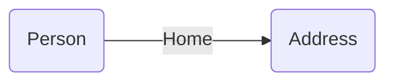
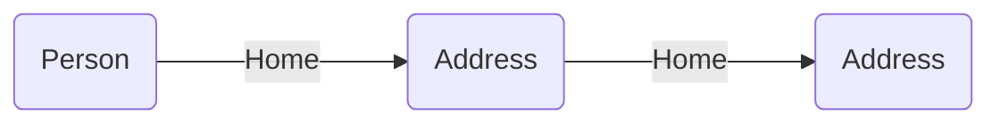
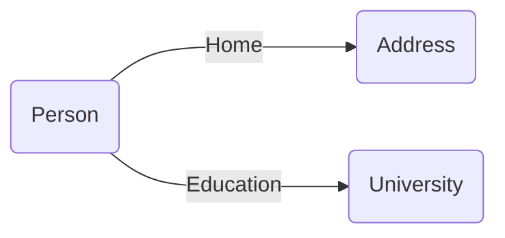
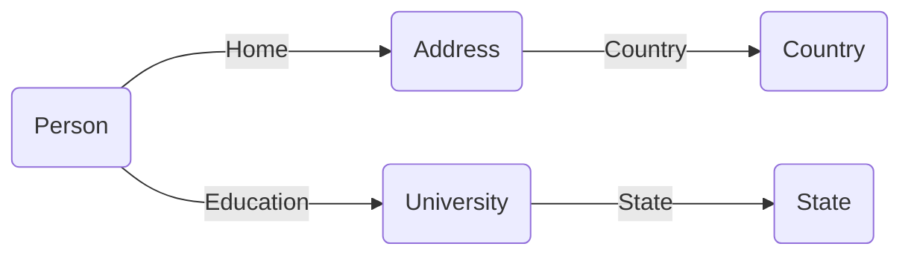
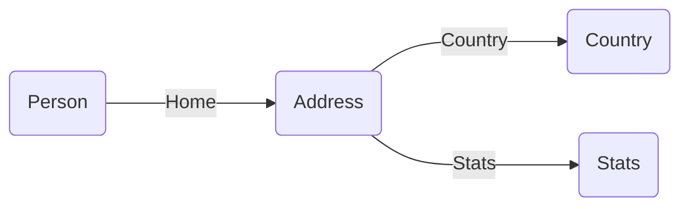
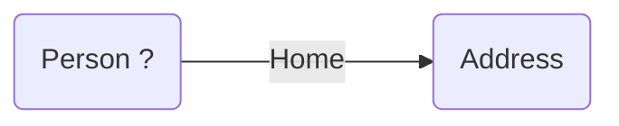

# Relationships


SQL databases return flat rows for both cardinality-one and -many relationships. Molecule can turn flat rows into return nested data as we'll see below.

Let's first look at flat cardinality-one relationships:


## Ref

Molecule uses the word "ref" for relationships between two entities/Tables since we have a _reference_ from entity A to B. Usually a simple auto-incremented `Long`.





In our domain structure we give the ref a name, like "home" to describe the relationship:

```scala
trait Person:
  val name = oneString
  val age  = oneInt
  val home = manyToOne[Address]

trait Address:
  val street = oneString
  val zip    = oneInt
```


We can then save Bob and his home address:

```scala
Person.name("Bob").age(42)
  .Home.street("Main st. 17").zip(10240).save.transact
```

"home" is capitalized when we transact and query the relationship.

```scala
Person.name.age.Home.street.zip.query.get.head ==> 
  ("Bob", 42, "Main st. 17", 10240) 
```


### Ref attr

We can also retrieve the "ref attribute" (or "ref id" / foreign key) as a value with the lowercase name:
```scala
Person.name.age.home.query.get.head ==> 
  ("Bob", 42, 1L) 
```
When we use the lowercase ref attribute we can't continue building into the `Address` entity as before. 


But we can get both if we add the special `id` attribute to `Home`:
```scala
Person.name.age.Home.id.street.zip.query.get.head ==> 
  ("Bob", 42, 1L, "Main st. 17", 10240) 
```


### Chain refs

We can continue to add refs:


```scala
Person.name.age.Home.street.zip.Country.name.query.get.head ==>
  ("Bob", 42, "Main st. 17", 10240, "USA")

// or
Person.name.age
  .Home.street.zip
  .Country.name.query.get.head ==>
  ("Bob", 42, "Main st. 17", 10240, "USA")
```


## Backref

Sometimes we want to reference multiple entities from a previous entity to get information from multiple sources in one query. 

We can then use a "back ref" to "get back" to the previous entity in order to make a new ref from there. Each branch of the relationship graph is independent. 

Let's create one branch from `Person` to `Address` and tie it together with another branch from `Person` to `University` in one query.


The backref `_Person` brings us back to the `Person` entity so that we can create a new relationship/branch from there:
```scala
Person.name.age
  .Home.street.zip // branch 1
  ._Person // backref to Person
  .Education.shortName // branch 2: Education is a ref from Person
  .query.get.head ==>
  (
    "Bob", 42,
    "Main st. 17", 10240, // branch 1 data 
    "Harvard" // branch 2 data
  )
```
Let's go two refs ahead in one branch of the relationship graph and then step back twice to get back to `Person` so that we can reach `Education` and `State` in a second branch:




```scala
Person.name.age
  .Home.street.zip.Country.name // branch 1
  ._Address._Person // 2 backrefs to Person
  .Education.shortName.State.abbr // branch 2
  .query.get.head ==>
  (
    "Bob", 42,
    "Main st. 17", 10240, "USA", // branch 1 data 
    "Harvard", "MA" // branch 2 data
  )
```
Note that we need to use the original entity name `_Address` as back ref, not `_Home`:

We can also branch out from intermediary entities:


```scala
Person.name.age
  .Home.street.zip.Country.name // branch 1
  ._Address // one backref to Address
  .Stats.crimeRate // branch 2
  .query.get.head ==>
  (
    "Bob", 42, 
    "Main st. 17", 10240, "USA", // branch 1 data 
    "Low" // branch 2 data
  )
```
As you can see, we can easily model complex relationships and retrieve data through multiple relationships.


## Opt ref

A cardinality-one relationship can also have an _optional reference_ from A to B, like a `LEFT JOIN` in SQL.

"Does this Person have a relationship to an Address?"


We initiate the optional relationship with `<Ref>.?` and then use the ref `<Entity>` inside parentheses to pick the attributes we are interested in. The data of the inside molecule is returned in an `Option`:

```scala
// One optional related attribute 
Person.name.age.Home.?(Address.street).query.get ==> List(
  ("Bob", 42, Some("Main st. 17")), // Option[<value>]
  ("Liz", 38, None)
)

// Multiple optional related attributes
Person.name.age.Home.?(Address.street.zip).query.get ==> List(
  ("Bob", 42, Some(("Main st. 17", 10240))), // Option[<tuple>]
  ("Liz", 38, None)
)
```

## Opt entity

A cardinality-one relationship can also be optional, like a `RIGHT JOIN` in SQL.

"Is there a Person with a relationship to this Address?"



We start the optonal entity with `<Entity>.?()`
We initiate the optional relationship with `<Ref>.?` and then use the ref `<Entity>` inside parentheses to pick the attributes we are interested in. The data of the inside molecule is returned in an `Option`:

```scala
Address.street("Lonely st. 1").save.transact

// No one lives on Lonely st.
Person.?(Person.name).Home.street.query.get ==> List(
  (Some("Bob"), "Main st. 17"),
  (None, "Lonely st. 1"),
)
```

### Mix

You can mix mandatory and optional cardinality-one relationships in Molecule in certain ways:

Mandatory ref _before_ optional ref is allowed:

```scala
Person.name.age
  .Home.street.zip //                           Person --- Home
  ._Person.Education.?(University.shortName) // Person -?- Education
  .query.get ==> List(
  (
    "Bob", 42,
    "Main st. 17", 10240,
    Some("Harvard"),
  )
  // (Liz not included since home address is mandatory)
)
```

Mandatory ref **_after_** optional ref is **_not_** allowed:

```scala
intercept[ModelError] {
  Person.name.age
    .Home.?(Address.street.zip) // Person -?- Home
    .Education.shortName //        Person --- Education
    .query.get ==> List(
    (
      "Bob", 42,
      Some(("Main st. 17", 10240)),
      Some("Harvard"),
    ),
    (
      "Liz", 38,
      None,
      None
    )
  )
}.msg ==> "Only further optional refs allowed after optional ref."
```

### Adjacent

Adjacent optional refs is allowed. Note how it is presumed that each optional ref starts from `Person` (so we don't need to backref with `_Person` in this case)
```scala
Person.name.age
  .Home.?(Address.street.zip) //        Person -?- Home
  .Education.?(University.shortName) // Person -?- Education
  .query.get ==> List(
  (
    "Bob", 42,
    Some(("Main st. 17", 10240)),
    Some("Harvard"),
  ),
  (
    "Liz", 38,
    None,
    None
  )
)
```

### Ref inside


Mandatory ref (`Country`) on inside optional ref molecule is allowed:
```scala
Person.name.age
  .Home.?(Address.street.Country.name).query.get ==> List(
  ("Bob", 42, Some(("Main st. 17", "USA"))),
  ("Liz", 38, None)
)
```

### Opt ref inside

And we can even have optional refs inside optional refs:

```scala
Person.name.age
  .Home.?(Address.street.zip
    .Country.?(Country.name)).query.get ==> List(
  
  ("Bob", 42, Some(
    ("Main st. 17", 10240, Some(
      "USA")))),
  
  ("Liz", 38, None)
)
```


## Nested

If there's a cardinality-many relationship between Teachers and their Classes we can ask for the flat data as we did in the above examples for cardinality-one relationships.

```scala
Teacher.name.Classes.subject.query.get ==> List(
  ("Maggie", "Math"),
  ("Maggie", "Physics"),
  ("Ronnie", "Biology"),
  ("Ronnie", "English"),
)
```
But then the name of the Teacher will be redundantly repeated for each Class. 

Instead, we want to get a nested list of Class subjects for each teacher:
```scala
Teacher.name.Classes.*(Class.subject).query.get ==> List(
  ("Maggie", List("Math", "Physics")),
  ("Ronnie", List("Biology", "English")),
)
```

The cardinality-many nested operator `*`, which is often a symbol for "many", lets Molecule format and return the hierarchical and typed data that we want.


### Multiple levels

In fact, we can use the nested notation also for transactions and with up to 7 levels deeply nested data! Let's expand our data a bit with Students too:

```scala
// Insert 6 Students
val List(a, b, c, d, e, f) = Student.name.age.insert(
  ("Ann", 13),
  ("Ben", 14),
  ("Cat", 13),
  ("Dan", 14),
  ("Eva", 14),
  ("Fay", 15),
).transact.ids

// Insert Teachers and Classes, each with some Students
Teacher.name.Classes.*(Class.subject.students).insert(
  ("Maggie", List(
    ("Math", Set(a, b, c)),
    ("Physics", Set(d, e, f)),
  )),
  ("Ronnie", List(
    ("Biology", Set(a, b, c)),
    ("English", Set(d, e, f)),
  )),
).transact
```

Now we can query for 2 levels deep hierarchical data
```scala
Teacher.name.a1
  .Classes.*(Class.subject
    .Students.*(Student.name.age)).query.get ==> List(
  ("Maggie", List(
    ("Math", List(
      ("Ann", 13),
      ("Ben", 14),
      ("Cat", 13),
    )),
    ("Physics", List(
      ("Dan", 14),
      ("Eva", 14),
      ("Fay", 15),
    )),
  )),
  ("Ronnie", List(
    ("Biology", List(
      ("Ann", 13),
      ("Ben", 14),
      ("Cat", 13),
    )),
    ("English", List(
      ("Dan", 14),
      ("Eva", 14),
      ("Fay", 15),
    )),
  )),
)
```

The nested notation `*` ensures that there's an existing relationship to the nested data.


## Opt nested

If we instead use `*?` we can get optional nested data. If no relationship exists, an empty list is returned.

We can for instance add a new teacher for some Classes where students haven't yet been assigned:


```scala
Teacher.name.Classes.*(Class.subject).insert(
  ("Veronica", List("Chemistry", "Drama")),
).transact
```

Now we'll even get Veronica and her Classes, but with no Students of hers:

```scala
Teacher.name
  .Classes.*?(Class.subject
    .Students.*?(Student.name.age)).query.get ==> List(
  ("Maggie", List(
    ("Math", List(
      ("Ann", 13),
      ("Ben", 14),
      ("Cat", 13),
    )),
    ("Physics", List(
      ("Dan", 14),
      ("Eva", 14),
      ("Fay", 15),
    )),
  )),
  ("Ronnie", List(
    ("Biology", List(
      ("Ann", 13),
      ("Ben", 14),
      ("Cat", 13),
    )),
    ("English", List(
      ("Dan", 14),
      ("Eva", 14),
      ("Fay", 15),
    )),
  )),
  ("Veronica", List(
    ("Chemistry", List()), // no students yet
    ("Drama", List()), //     no students yet
  )),
)
```
Molecule doesn't allow mixing mandatory/optional nested queries.


##### [<i class="fas fa-handshake" style="margin-right: 4px;"></i> Relationship compliance tests](https://github.com/scalamolecule/molecule/tree/main/db/compliance/shared/src/test/scala/molecule/db/compliance/test/relation)