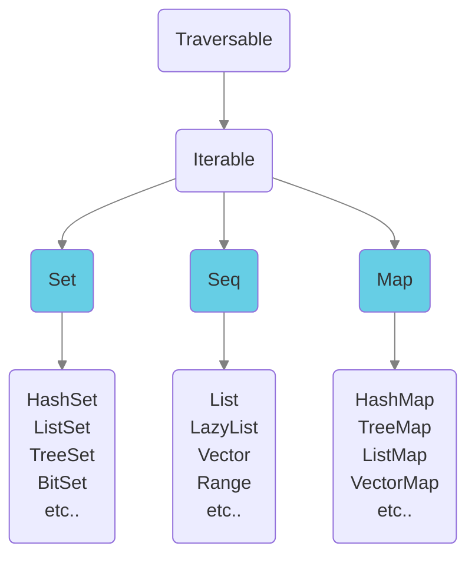

# Domain structure

Define the structure of your domain with entities (traits) and attributes (properties) in a plain Scala file:

```scala
import molecule.DomainStructure

object Community extends DomainStructure {
  trait Person { // entity
    val name    = oneString // attribute
    val age     = oneInt
    val address = manyToOne[Address] // relationship
  }
  trait Address {
    val street = oneString
    val zip    = oneString
  }
}
```
Molecule generates boilerplate code from this definition so that you can compose molecules of domain data.

In SQL databases, entities/attributes translate to tables and columns.


## Segments

A complex domain can group conceptually related entities in Segments as objects (beginning with lowercase letter):   

```scala
object Company extends DomainStructure {
  
  // HR segment 
  object hr { 
    trait Profession {
      val name = oneString
    }
    trait Person {
      val name        = oneString
      val professions = manyToOne[Profession]
    }
  }

  // Accounting segment
  object accounting { 
    trait Invoice {
      val no          = oneInt
      val contact     = manyToOne[hr.Person]
      val mainProduct = manyToOne[warehouse.Item]
      val lines       = manyToOne[InvoiceLine]
    }
    trait InvoiceLine {
      val text    = oneString
      val qty     = oneInt
      val product = manyToOne[warehouse.Item]
    }
  }

  // Warehouse segment
  object warehouse { 
    trait Item {
      val name      = oneString
      val available = oneBoolean
    }
  }
}
```
Entities are then prefixed with the segment/object names: 

- `hr_Profession`
- `hr_Person`
- `accounting_Invoice`
- `accounting_InvoiceLine`
- `warehouse_Item`

A molecule using entity names of the `accounting` seqment could look like this:

```scala
accounting_Invoice.no.Contact.name.query.get
```


## Attributes

As we saw in the examples above, an attribute is defined as `val` that points to a marker defining the type of the attribute:

```scala
val firstName = oneString
```
The "one" part indicates that this is single scalar value. It can also be "set", "seq" or "map" since Molecule supports collection types too.


Unlike other database libraries that accommodate to the available types of various databases, Molecule thinks the other way around and enables the database to handle all Scala primitives. 
   

All primitive Scala type plus some common java types can be defined as attributes:

- All primitive types of Scala
- java.net.URI
- java.time.*
- java.util.{Date, UUID}

Molecule transparently maps each type to a corresponding or useful value type for each database. 
                

### Collections

Molecule saves collection data as arrays or json depending on the capability of the database. All immutable `Set`, `Seq` and `Map` Scala collection types can be saved with Molecule.

When a complete many-to-many relation to other entities are overkill, like a few nicknames, then we can for instance pick a `Set` from the immutable collections hierarchy of Scala: 



Collection types are prefixed to the attribute type in the domain structure definition:

```scala
val hobbies      = setString // Set of String
val scores       = seqInt //    Seq of ordered Int
val translations = mapString // Map of String -> String
```
All Map types take keys as Strings.

Overview of all type markers and corresponding Scala types:

::: code-tabs#types
@tab Primitives
```scala
oneString         : String
oneChar           : Char

oneBoolean        : Boolean

oneByte           : Byte
oneInt            : Int
oneLong           : Long
oneBigInt         : BigInt

oneShort          : Short
oneFloat          : Float
oneDouble         : Double
oneBigDecimal     : BigDecimal

oneURI            : java.net.URI
oneUUID           : java.util.UUID
oneDate           : java.util.Date

oneDuration       : java.time.Duration
oneInstant        : java.time.Instant
oneLocalDate      : java.time.LocalDate
oneLocalTime      : java.time.LocalTime
oneLocalDateTime  : java.time.LocalDateTime
oneOffsetTime     : java.time.OffsetTime
oneOffsetDateTime : java.time.OffsetDateTime
oneZonedDateTime  : java.time.ZonedDateTime

oneEnum[T]        : T where T is a Scala 3 enum
```

@tab Set
```scala
setString         : Set[String]
setChar           : Set[Char]

setBoolean        : Set[Boolean]

setByte           : Set[Byte]
setInt            : Set[Int]
setLong           : Set[Long]
setBigInt         : Set[BigInt]

setShort          : Set[Short]
setFloat          : Set[Float]
setDouble         : Set[Double]
setBigDecimal     : Set[BigDecimal]

setURI            : Set[java.net.URI]
setDate           : Set[java.util.Date]
setUUID           : Set[java.util.UUID]

setDuration       : Set[java.time.Duration]
setInstant        : Set[java.time.Instant]
setLocalDate      : Set[java.time.LocalDate]
setLocalTime      : Set[java.time.LocalTime]
setLocalDateTime  : Set[java.time.LocalDateTime]
setOffsetTime     : Set[java.time.OffsetTime]
setOffsetDateTime : Set[java.time.OffsetDateTime]
setZonedDateTime  : Set[java.time.ZonedDateTime]
```

@tab Seq
```scala
seqString         : Seq[String]
seqChar           : Seq[Char]

seqBoolean        : Seq[Boolean]

arrayByte         : Array[Byte] // special case for byte arrays
seqInt            : Seq[Int]
seqLong           : Seq[Long]
seqBigInt         : Seq[BigInt]

seqShort          : Seq[Short]
seqFloat          : Seq[Float]
seqDouble         : Seq[Double]
seqBigDecimal     : Seq[BigDecimal]

seqURI            : Seq[java.net.URI]
seqDate           : Seq[java.util.Date]
seqUUID           : Seq[java.util.UUID]

seqDuration       : Seq[java.time.Duration]
seqInstant        : Seq[java.time.Instant]
seqLocalDate      : Seq[java.time.LocalDate]
seqLocalTime      : Seq[java.time.LocalTime]
seqLocalDateTime  : Seq[java.time.LocalDateTime]
seqOffsetTime     : Seq[java.time.OffsetTime]
seqOffsetDateTime : Seq[java.time.OffsetDateTime]
seqZonedDateTime  : Seq[java.time.ZonedDateTime]
```

@tab Map
```scala
mapString         : Map[String, String]
mapChar           : Map[String, Char]

mapBoolean        : Map[String, Boolean]

mapByte           : Map[String, Byte]
mapInt            : Map[String, Int]
mapLong           : Map[String, Long]
mapBigInt         : Map[String, BigInt]

mapShort          : Map[String, Short]
mapFloat          : Map[String, Float]
mapDouble         : Map[String, Double]
mapBigDecimal     : Map[String, BigDecimal]

mapURI            : Map[String, java.net.URI]
mapUUID           : Map[String, java.util.UUID]
mapDate           : Map[String, java.util.Date]

mapDuration       : Map[String, java.time.Duration]
mapInstant        : Map[String, java.time.Instant]
mapLocalDate      : Map[String, java.time.LocalDate]
mapLocalTime      : Map[String, java.time.LocalTime]
mapLocalDateTime  : Map[String, java.time.LocalDateTime]
mapOffsetTime     : Map[String, java.time.OffsetTime]
mapOffsetDateTime : Map[String, java.time.OffsetDateTime]
mapZonedDateTime  : Map[String, java.time.ZonedDateTime]
```
:::


Molecule transparently persist and retrieves all Scala primitive/collection types to the most optimal data type in each database. This gives you freedom to model your domain data with exactly the same Scala types that you would use for your domain class properties. 


### Set

A collection type is useful when you want to simply save a smaller collection of values, like for instance a `Set` of hobbies. If the number of values grow big or other information about the values is needed, it might be better to define a relationship to a separate Hobby entity with its own attributes:

::: code-tabs
@tab Collection

```scala
trait Person:
  val name    = oneString
  val hobbies = setString // Set of String values only
```

@tab Related

```scala
trait Person:
  val name = oneString

trait Hobby:
  val name = oneString
  
// Many-to-many relationship - Persons and Hobbies are independent
trait Interest:
  val person = manyToOne[Person]
  val hobby  = manyToOne[Hobby]
```
:::

Sets of unique un-ordered values are saved transparently by Molecule as Arrays or JSON in SQL databases. Molecule ensures that values are unique. 

In your code you can simply think in terms of a Scala `Set`.


### Seq

`Seq`s, or `List`s of ordered non-unique values are saved transparently by Molecule as Arrays or Json arrays for SQL databases. 

In your code you can simply think in terms of a Scala `Seq`.


### Map

In databases that support json, `Map`s are saved as json. Otherwise, a synthetic related entity is transparently managed by Molecule.


In your code you can simply think in terms of a Scala `Map`.


## Attribute options

One or more options can be added to each attribute definition. 

Here we define a `lastName` attribute and ask the database to index it and make it mandatory when persisting entities where the attribute belongs. So, if we want to add a `Person` in the database, we can only save it if the `lastName` attribute is set.

```scala
val lastName = oneString.description("Last name of person").indexed.mandatory
```

The following Attribute definition options are available in Molecule:


### `description`

A description of an attribute is used to simply clarify the intention of the attribute. 
The description can be added either with the `description` method or applied to the type definition:

```scala
val lastName = oneString.description("Last name of person")
// or
val lastName = oneString("Last name of person")
```


### `alias`

If we need to define an attribute name that clashes with a Scala keyword, an alias can be added:

```scala
val `type` = oneString.alias("tpe")
```
Then we can access the attribute in molecules with the alias: 

```scala
Event.tpe.query.get
```
Molecule transparently uses the original name against the database.


### `allowedValues`

Allowed values can be added for any primitive type. Molecule will then validate that only defined enum values are transacted. A custom error message can be added:

```scala
val luckyNumber = oneInt.enums(7, 9, 13)
// or
val luckyNumberWithErrMsg = oneInt.enums(
  Seq(7, 9, 13),
  "Lucky number can only be 7, 9 or 13"
)
```

### `enum`
Scala 3 enumerations can be defined in the DomainStructure and an attribute defined to only accept those enums:
```scala
object Community extends DomainStructure {

  enum Color:
    case RED, BLUE, GREEN

  // Test various options
  trait Person {
    val name          = oneString
    val favoriteColor = oneEnum[Color]
  }
}
```
And using the enums could look like this:
```scala
Person.name("Bob").favoriteColor(Color.BLUE).save.transact
Person.name.favoriteColor.query.get.head ==> ("Bob", Color.BLUE.toString)
```
Enum values are saved as strings in the database and returned as such. 

(We can't dynamical type the string to the enum type for technical reasons)

### `index`

Adding the index option tells Molecule to add indexing for the attribute in the generated schema definition for a database (if possible for the specific database).


```scala
val lastName = oneString.index
```


### `unique`

Enforce that the value of an attribute is always unique:

```scala
val socialSecurityNumber = oneString.unique
```

### `mandatory`

Enforce that the value of an attribute is always present:

```scala
val lastName = oneString.mandatory

// Relationships can also be enforced
val neededRef  = manyToOne[NeededRef].mandatory
```

### `require`

An attribute can require that a value exists for another attribute:

```scala
// Pair of data guaranteed
val username = oneString.require(password)
val password = oneString
```

Even multiple required attributes can be defined

```scala
// Triple of data guaranteed
// Only 3-dimensional points with all 3 coordinates present are valid
val x = oneInt.require(y, z)
val y = oneInt
val z = oneInt

// Attributes can only be required once.
// Another attribute w can't require z since z is already required
// val w = oneInt.require(z)
```

### String options

`regex`

String attributes can be enforced to only have values that conform to a regex pattern:

```scala
val username = oneString.regex("^[a-zA-Z0-9]+$")
// or
val usernameWithErrMsg = oneString.regex(
  "^[a-zA-Z0-9]+$",
  "Username cannot contain special characters."
)
```

<br>

`email`

String attributes can be defined to only accept valid emails:

```scala
val email = oneString.email

// or with custom error message
val emailWithMsg = oneString.email("Please provide a real email")
```
Strings are validated against the following regex taken from [here](https://www.baeldung.com/java-email-validation-regex).
```
// Email match, allowing unicode characters
"^(?=.{1,64}@)[\\p{L}0-9_-]+(\\.[\\p{L}0-9_-]+)*@[^-][\\p{L}0-9-]+(\\.[\\p{L}0-9-]+)*(\\.[\\p{L}]{2,})$".r
```


## Relationships

As in an SQL schema definition we define a relationship with a foreign key attribute that points to the related entity.

For instance we define `InvoiceLine`s to have a foreign key attribute `invoice` that points to the `Invoice` they belong to:

```scala
trait InvoiceLine:
  val invoice = manyToOne[Invoice] // foreign key to one Invoice
```

As with SQL, in Molecule, we always define a relationship on the entity where the foreign key is, the "many" side. To be explicit about this, we use the `manyToOne` method to define the relationship. Many invoice lines are related to one invoice.


#### Foreign key constraint 

For each foreign key defined, Molecule adds a foreign key constraint in the generated SQL schema definition:

```sql
-- Foreign key constraints
ALTER TABLE InvoiceLine 
  ADD CONSTRAINT `_invoice` 
  FOREIGN KEY (invoice) 
  REFERENCES Invoice (id);
```


#### Foreign key index

Molecule also generates an index for the foreign key attribute in the generated SQL schema definition:

```sql
-- Foreign key indexes
CREATE INDEX IF NOT EXISTS _InvoiceLine_invoice ON InvoiceLine (invoice);
```


#### Foreign key attribute

The `invoice` foreign key attribute is accessible as any other attribute:

```scala
val invoiceId: Long = InvoiceLine.invoice.query.get.head
```

### Many-to-one

Molecule uses the capitalized name of the foreign key attribute as a relationship accessor name to go from the many-side to the one-side.

In our invoice example we can therefore query the original many-to-one relationship from `InvoiceLine` to `Invoice` by using the capitalized `Invoice` many-to-one relationship accessor:

::: code-tabs
@tab Molecule
```scala
InvoiceLine.product.Invoice.no.query.get ==> List(
  ("Chocolate", 2),
  ("Coffee", 1),
  ("Milk", 1),
  ("Tea", 1),
  ("Tea", 2),
)
```
@tab SQL
```sql
SELECT DISTINCT
  InvoiceLine.product,
  Invoice.no
FROM InvoiceLine
  INNER JOIN Invoice ON
    InvoiceLine.invoice = Invoice.id
WHERE
  InvoiceLine.product IS NOT NULL AND
  Invoice.no          IS NOT NULL;
```
:::

### One-to-many

Molecule also generates a relationship accessor in the reverse direction from the one-side to the many-side by using the pluralized name of the entity where the relationship is defined. In our example, "InvoiceLine" where the relationship is defined is pluralized to "InvoiceLines".

So now we can query the one-to-many relationship from `Invoice` to `InvoiceLine` by using the `InvoiceLines` one-to-many relationship accessor:

::: code-tabs
@tab Molecule
```scala
Invoice.no.InvoiceLines.product.query.get ==> List(
  (1, "Coffee"),
  (1, "Milk"),
  (1, "Tea"),
  (2, "Chocolate"),
  (2, "Tea"),
)
```
@tab SQL
```sql
SELECT DISTINCT
  Invoice.no,
  InvoiceLine.product
FROM Invoice
  INNER JOIN InvoiceLine ON
    Invoice.id = InvoiceLine.invoice
WHERE
  Invoice.no          IS NOT NULL AND
  InvoiceLine.product IS NOT NULL;
```
:::


::: info
Note that relationships - independent of bidirectional queries - are always defined from the "many" side to the "one" side.
:::

#### Custom one-to-many name

We can also define the one-to-many relationship name explicitly by adding `oneToMany("MyName")` after the relationship definition:
```scala
trait InvoiceLine:
  val invoice = manyToOne[Invoice].oneToMany("Lines")
```
Then Molecule will call the reverse relationship accessor `Lines` instead. The SQL query will be the same as above since `Lines` still points to the same table `InvoiceLine`:

::: code-tabs
@tab Molecule
```scala
Invoice.no.Lines.product.query.get ==> List(
  (1, "Coffee"),
  (1, "Milk"),
  (1, "Tea"),
  (2, "Chocolate"),
  (2, "Tea"),
)
```
@tab SQL
```sql
SELECT DISTINCT
  Invoice.no,
  InvoiceLine.product
FROM Invoice
  INNER JOIN InvoiceLine ON
    Invoice.id = InvoiceLine.invoice
WHERE
  Invoice.no          IS NOT NULL AND
  InvoiceLine.product IS NOT NULL;
```
:::


### Cascade delete

Add the `owner` option to a relationship definition to delete all related entities when the "owner" entity is deleted.

In our invoice example, we can define the invoice relationship with `owner` to let the invoice own its invoice lines:

```scala
val invoice = manyToOne[Invoice].owner // Invoice owns its invoice lines

// or with custom reverse name
val invoice = manyToOne[Invoice].oneToMany("Lines").owner
```

Adding the `owner` option makes Molecule add "ON DELETE CASCADE" to the foreign key constraint in the generated SQL schema definition:

```sql
-- Foreign key constraints
ALTER TABLE InvoiceLine 
  ADD CONSTRAINT `_invoice` 
  FOREIGN KEY (invoice) 
  REFERENCES Invoice (id) 
  ON DELETE CASCADE;
```

::: warning
Beware! Owned relationships _delete all related entities_ when the "owner" entity is deleted. So in the example above, if an invoice is deleted, all its invoice lines will be deleted!
:::


### Nested accessor

One-to-many relationships can even be queried as [nested data](/database/relationships/nested), now using the `Lines.*` accessor:

::: code-tabs
@tab Molecule
```scala
Invoice.no.Lines.*(InvoiceLine.product).query.i.get ==> List(
  (1, List("Coffee", "Milk", "Tea")),
  (2, List("Chocolate", "Tea")),
)
```
@tab SQL
```sql
SELECT DISTINCT
  Invoice.id,
  Invoice.no,
  InvoiceLine.product
FROM Invoice
  INNER JOIN InvoiceLine ON
    Invoice.id = InvoiceLine.invoice
WHERE
  Invoice.no          IS NOT NULL AND
  InvoiceLine.product IS NOT NULL;
```
:::

The only difference between the "flat" and "nested" SQL queries is that Molecule for the nested query also returns the id of the parent entity (`Invoice.id`) in order to nest the data correctly.

### Many-to-many

As in SQL, a many-to-many relationship is defined in Molecule with a join table/entity that defines two or more many-to-one relationships to the entities that need to be joined.

To be treated as a many-to-many relationship by Molecule, the joining entity (`Assignment`) must extend the `Join` trait as shown below:

```scala
object Company extends DomainStructure {
  trait Project {
    val name   = oneString
    val budget = oneInt
  }
  trait Employee {
    val name = oneString
  }
  trait Assignment extends Join { // extend Join to treat as many-to-many
    val project  = manyToOne[Project]
    val employee = manyToOne[Employee]
    val role     = oneString
  }
}
```
We can still query with a normal one-to-many nested relationship from `Project` to `Assignment` and then a flat many-to-one relationship from `Assignment` to `Employee`:

::: code-tabs
@tab Molecule
```scala
Project.name.Assignments.*(Assignment.Employee.name).query.get ==> List(
  ("BigProject", List("Alice", "Bob", "Carol", "Diana")),
  ("MediumProject", List("Alice", "Bob", "Eve", "Frank")),
  ("SmallProject", List("Grace")),
)
```
@tab SQL
```sql
SELECT DISTINCT
  Project.id,
  Project.name,
  Employee.name
FROM Project
  INNER JOIN Assignment ON
    Project.id = Assignment.project
  INNER JOIN Employee ON
    Assignment.employee = Employee.id
WHERE
  Project.name  IS NOT NULL AND
  Employee.name IS NOT NULL;
```
:::


### Bridged accessor

But by extending the `Join` trait, we can also query the many-to-many relationship directly from `Project` to `Employee` by using the bridging `Employees.**` many-to-many relationship accessor:

::: code-tabs
@tab Molecule
```scala
Project.name.Employees.**(Employee.name).query.get ==> List(
  ("BigProject", List("Alice", "Bob", "Carol", "Diana")),
  ("MediumProject", List("Alice", "Bob", "Eve", "Frank")),
  ("SmallProject", List("Grace")),
)
```
@tab SQL
```sql
SELECT DISTINCT
  Project.id,
  Project.name,
  Employee.name
FROM Project
  INNER JOIN Assignment ON
    Project.id = Assignment.project
  INNER JOIN Employee ON
    Assignment.employee = Employee.id
WHERE
  Project.name  IS NOT NULL AND
  Employee.name IS NOT NULL;
```
:::

The `Employees.**` accessor is simply convenience syntax sugar for the previous two-step relationship build-up. So the generated SQL is exactly the same in both queries.

And vice-versa we can make a bridged query in the opposite direction too:

::: code-tabs
@tab Molecule
```scala
Employee.name.Projects.**(Project.name).query.get ==> List(
  ("Alice", List("BigProject", "MediumProject")),
  ("Bob", List("BigProject", "MediumProject")),
  ("Carol", List("BigProject")),
  ("Diana", List("BigProject")),
  ("Eve", List("MediumProject")),
  ("Frank", List("MediumProject")),
  ("Grace", List("SmallProject")),
)
```
@tab SQL
```sql
SELECT DISTINCT
  Employee.id,
  Employee.name,
  Project.name
FROM Employee
  INNER JOIN Assignment ON
    Employee.id = Assignment.employee
  INNER JOIN Project ON
    Assignment.project = Project.id
WHERE
  Employee.name IS NOT NULL AND
  Project.name  IS NOT NULL;
```
:::
