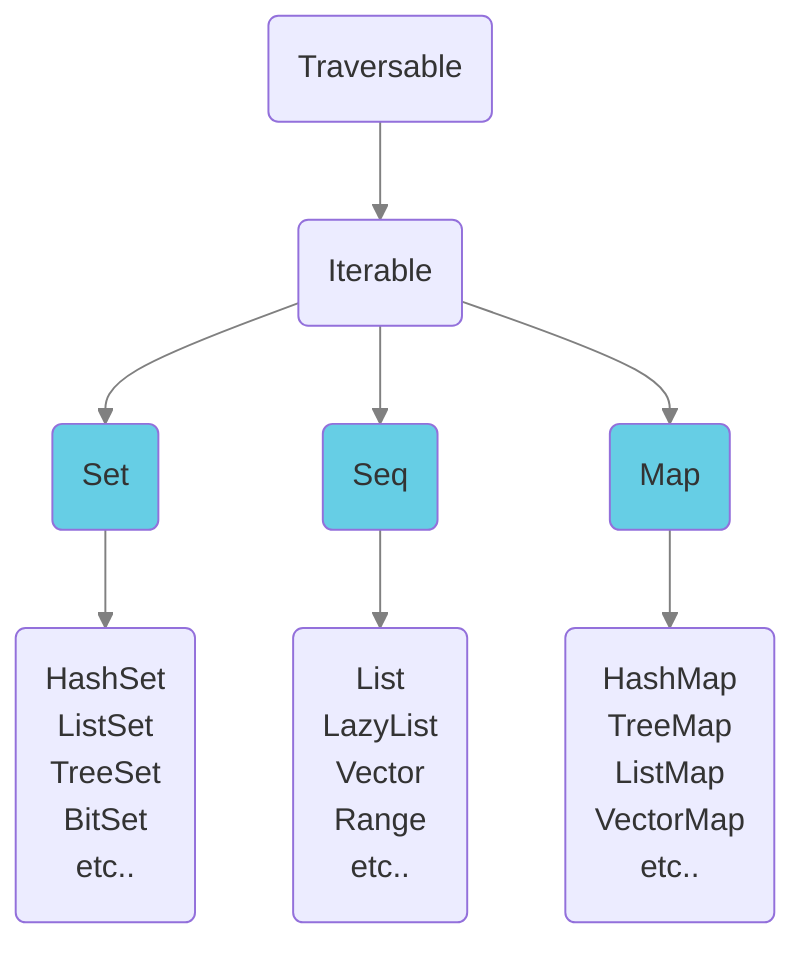

# Domain structure

Define the structure of your domain with entities (traits) and attributes (properties) in a plain Scala file:

```scala
import molecule.DomainStructure

object Community extends DomainStructure {
  trait Person { // entity
    val name    = oneString // attribute
    val age     = oneInt
    val address = one[Address] // relationship
  }
  trait Address {
    val street = oneString
    val zip    = oneString
  }
}
```
Molecule generates boilerplate code from this definition so that you can compose molecules of domain data.

In SQL databases, entities/attributes translate to Tables and Columns.


## Groups of entities

A complex domain can group conceptually related entities in Segments as objects (beginning with lowercase letter):   

```scala
object Company extends DomainStructure {
  
  // HR seqment 
  object hr { 
    trait Profession {
      val name = oneString
    }
    trait Person {
      val name        = oneString
      val professions = many[Profession]
    }
  }

  // Accounting seqment
  object accounting { 
    trait Invoice {
      val no          = oneInt
      val contact     = one[hr.Person]
      val mainProduct = one[warehouse.Item]
      val lines       = many[InvoiceLine]
    }
    trait InvoiceLine {
      val text    = oneString
      val qty     = oneInt
      val product = one[warehouse.Item]
    }
  }

  // Warehouse seqment
  object warehouse { 
    trait Item {
      val name      = oneString
      val available = oneBoolean
    }
  }
}
```
Entities are then prefixed with the segment/object names: 

- `hr_Profession`
- `hr_Person`
- `accounting_Invoice`
- `accounting_InvoiceLine`
- `warehouse_Item`

A molecule using entity names of the `accounting` seqment could look like this:

```scala
accounting_Invoice.no.Contact.name.query.get
```


## Attributes

As we saw in the examples above, an attribute is defined by applying a marker to a `val` with the name of the attribute:

```scala
val firstName = oneString
```
This defines the cardinality and type of the Attribute, here a String Attribute named "firstName" with cardinality-one (it contains a single value).

Unlike other database libraries that accommodate to the available types of various databases, Molecule thinks the other way around and enables the database to handle all Scala primitives. 
          
::: info
_"Let the database come to Scala"_ 

instead of 

"Let Scala come to the database"
:::

All primitive Scala type plus some common java types can be defined as attributes:

- All primitive types of Scala
- java.net.URI
- java.time.*
- java.util.{Date, UUID}

Molecule transparently maps each type to a corresponding or useful value type for each database. 
                

### Collections

Some databases support Arrays. 

But Molecule takes it all the way by persisting and querying all immutable `Set`, `Seq` and `Map` Scala collection types!

Again, think of data in your Scala code, and let it transparently be persisted in a database with Molecule. When a complete many-to-many relation to other entities are overkill, like a few nicknames, then we can for instance pick a `Set` from the immutable collections hierarchy of Scala: 



Collection types are prefixed to the element type in the domain structure definition:

```scala
val hobbies      = setString // Set of String
val scores       = seqInt //    Seq of ordered Int
val translations = mapString // Map of String -> String
```
All Map types take keys as Strings.

Overview of all type markers and corresponding Scala types:

::: code-tabs#types
@tab Primitives
```scala
oneString         : String
oneChar           : Char

oneBoolean        : Boolean

oneByte           : Byte
oneInt            : Int
oneLong           : Long
oneBigInt         : BigInt

oneShort          : Short
oneFloat          : Float
oneDouble         : Double
oneBigDecimal     : BigDecimal

oneURI            : java.net.URI
oneUUID           : java.util.UUID
oneDate           : java.util.Date

oneDuration       : java.time.Duration
oneInstant        : java.time.Instant
oneLocalDate      : java.time.LocalDate
oneLocalTime      : java.time.LocalTime
oneLocalDateTime  : java.time.LocalDateTime
oneOffsetTime     : java.time.OffsetTime
oneOffsetDateTime : java.time.OffsetDateTime
oneZonedDateTime  : java.time.ZonedDateTime

oneEnum[T]        : T where T is a Scala 3 enum
```

@tab Set
```scala
setString         : Set[String]
setChar           : Set[Char]

setBoolean        : Set[Boolean]

setByte           : Set[Byte]
setInt            : Set[Int]
setLong           : Set[Long]
setBigInt         : Set[BigInt]

setShort          : Set[Short]
setFloat          : Set[Float]
setDouble         : Set[Double]
setBigDecimal     : Set[BigDecimal]

setURI            : Set[java.net.URI]
setDate           : Set[java.util.Date]
setUUID           : Set[java.util.UUID]

setDuration       : Set[java.time.Duration]
setInstant        : Set[java.time.Instant]
setLocalDate      : Set[java.time.LocalDate]
setLocalTime      : Set[java.time.LocalTime]
setLocalDateTime  : Set[java.time.LocalDateTime]
setOffsetTime     : Set[java.time.OffsetTime]
setOffsetDateTime : Set[java.time.OffsetDateTime]
setZonedDateTime  : Set[java.time.ZonedDateTime]
```

@tab Seq
```scala
seqString         : Seq[String]
seqChar           : Seq[Char]

seqBoolean        : Seq[Boolean]

arrayByte         : Array[Byte] // special case for byte arrays
seqInt            : Seq[Int]
seqLong           : Seq[Long]
seqBigInt         : Seq[BigInt]

seqShort          : Seq[Short]
seqFloat          : Seq[Float]
seqDouble         : Seq[Double]
seqBigDecimal     : Seq[BigDecimal]

seqURI            : Seq[java.net.URI]
seqDate           : Seq[java.util.Date]
seqUUID           : Seq[java.util.UUID]

seqDuration       : Seq[java.time.Duration]
seqInstant        : Seq[java.time.Instant]
seqLocalDate      : Seq[java.time.LocalDate]
seqLocalTime      : Seq[java.time.LocalTime]
seqLocalDateTime  : Seq[java.time.LocalDateTime]
seqOffsetTime     : Seq[java.time.OffsetTime]
seqOffsetDateTime : Seq[java.time.OffsetDateTime]
seqZonedDateTime  : Seq[java.time.ZonedDateTime]
```

@tab Map
```scala
mapString         : Map[String, String]
mapChar           : Map[String, Char]

mapBoolean        : Map[String, Boolean]

mapByte           : Map[String, Byte]
mapInt            : Map[String, Int]
mapLong           : Map[String, Long]
mapBigInt         : Map[String, BigInt]

mapShort          : Map[String, Short]
mapFloat          : Map[String, Float]
mapDouble         : Map[String, Double]
mapBigDecimal     : Map[String, BigDecimal]

mapURI            : Map[String, java.net.URI]
mapUUID           : Map[String, java.util.UUID]
mapDate           : Map[String, java.util.Date]

mapDuration       : Map[String, java.time.Duration]
mapInstant        : Map[String, java.time.Instant]
mapLocalDate      : Map[String, java.time.LocalDate]
mapLocalTime      : Map[String, java.time.LocalTime]
mapLocalDateTime  : Map[String, java.time.LocalDateTime]
mapOffsetTime     : Map[String, java.time.OffsetTime]
mapOffsetDateTime : Map[String, java.time.OffsetDateTime]
mapZonedDateTime  : Map[String, java.time.ZonedDateTime]
```
:::


Molecule transparently persist and retrieves all Scala primitive/collection types to the most optimal data type in each database. This gives you freedom to model your domain data with exactly the same Scala types that you would use for your domain class properties. 


### Set

A collection type is useful when you want to simply save a smaller collection of values, like for instance a `Set` of hobbies. If the number of values grow big or other information about the values is needed, it might be better to define a relationship to a separate Hobby entity with its own attributes:

::: code-tabs
@tab Collection

```scala
trait Person:
  val hobbies = setString // values only
```

@tab Separate Entity

```scala
trait Person:
  val hobbies = many[Hobby] // relationship to hobby names and descriptions

trait Hobby:
  val name        = oneString
  val description = oneString
```
:::

Sets of unique un-ordered values are saved transparently by Molecule as Arrays or Sets in the Databases supporting this. Alternatively as json arrays. Molecule ensures that values are unique. 

In your code you can simply think in terms of a Scala `Set`.


### Seq

`Seq`s, or `List`s of ordered non-unique values are saved transparently by Molecule as Arrays or Json arrays for SQL databases. 

In your code you can simply think in terms of a Scala `Seq`.


### Map

In databases that support json, `Map`s are saved as json. Otherwise, a synthetic related entity is transparently managed by Molecule.


In your code you can simply think in terms of a Scala `Map`.


## Relationships

Relationships are treated like attributes with a descriptive name of the relationship. 

The referenced entity is given as a type parameter to the relationship marker `one` or `many` as we saw in the examples above:

```scala
val address = one[Address]      // relationship to one Address
val lines   = many[InvoiceLine] // relationship to many invoice lines
```

### `owner`

Add `owner` to a relationship definition to have the defining entity own the related entities. An Invoice is for instance a natural owner of its Invoice Lines. So we would likely define the ownership:

```scala
val lines = many[InvoiceLine].owner // Invoice owns its invoice lines
```
If an invoice is then deleted, its invoice lines will also automatically be deleted!

::: warning
Beware! Owned relationships are deleted recursively! So if InvoiceLine had an owned relationship to other entities, those would also be deleted if the Invoice was deleted, and so forth!
:::


## Attribute options

One or more options can be added fluently to each attribute definition. 

Here we define a `lastName` attribute and ask the database to index it and make it mandatory when persisting entities where the attribute belongs. So, if we want to add a `Person` in the database, we can only save it if the `lastName` attribute is set.

```scala
val lastName = oneString.descr("Last name of person").indexed.mandatory
```

The following Attribute definition options are available in Molecule:


### `descr`

A description of an attribute is used to simply clarify the intention of the attribute. The description can be added either with the `descr` method or applied to the type definition:

```scala
val lastName = oneString.descr("Last name of person")
// or
val lastName = oneString("Last name of person")
```


### `alias`

If we need to define an attribute name that clashes with a Scala keyword, an alias can be added:

```scala
val `type` = oneString.alias("tpe")
```
Then we can access the attribute in molecules with the alias: 

```scala
Event.tpe.query.get
```
Molecule transparently uses the original name against the database.


### `allowedValues`

Allowed values can be added for any primitive type. Molecule will then validate that only defined enum values are transacted. A custom error message can be added:

```scala
val luckyNumber = oneInt.enums(7, 9, 13)
// or
val luckyNumberWithErrMsg = oneInt.enums(
  Seq(7, 9, 13),
  "Lucky number can only be 7, 9 or 13"
)
```

### `enum`
Scala 3 enumerations can be defined in the DomainStructure and an attribute defined to only accept those enums:
```scala
object Community extends DomainStructure {

  enum Color:
    case RED, BLUE, GREEN

  // Test various options
  trait Person {
    val name          = oneString
    val favoriteColor = oneEnum[Color]
  }
}
```
And using the enums could look like this:
```scala
Person.name("Bob").favoriteColor(Color.BLUE).save.transact
Person.name.favoriteColor_().query.get.map(_ ==> List(("Bob", Color.BLUE.toString)))
```
Enum values are saved as strings in the database and returned as such. 

(We can't dynamical type the string to the enum type for technical reasons)

### `index`

Adding the index option tells Molecule to add indexing for the attribute in the generated schema definition for a database (if possible for the specific database).


```scala
val lastName = oneString.index
```


### `unique`

Enforce that the value of an attribute is always unique:

```scala
val socialSecurityNumber = oneString.unique
```

### `mandatory`

Enforce that the value of an attribute is always unique:

```scala
val lastName = oneString.mandatory

// Relationships can also be enforced
val neededRef  = one[NeededRef].mandatory
val neededRefs = many[NeededRef].mandatory // at least one ref
```

### `require`

An attribute can require that a value exists for another attribute:

```scala
// Pair of data guaranteed
val username = oneString.require(password)
val password = oneString
```

Even multiple required attributes can be defined

```scala
// Triple of data guaranteed
// Only 3-dimensional points with all 3 coordinates present are valid
val x = oneInt.require(y, z)
val y = oneInt
val z = oneInt

// Attributes can only be required once.
// Another attribute w can't require z since z is already required
// val w = oneInt.require(z)
```

### String options

`regex`

String attributes can have values conforming to a regex pattern:

```scala
val username = oneString.regex("^[a-zA-Z0-9]+$")
// or
val usernameWithErrMsg = oneString.regex(
  "^[a-zA-Z0-9]+$",
  "Username cannot contain special characters."
)
```

<br>

`email`

String attributes can be defined to only accept valid emails:

```scala
val email = oneString.email

val emailWithMsg = oneString.email("Please provide a real email")
```
Strings are validated against the following regex taken from [here](https://www.baeldung.com/java-email-validation-regex).
```
// Email match, allowing unicode characters
"^(?=.{1,64}@)[\\p{L}0-9_-]+(\\.[\\p{L}0-9_-]+)*@[^-][\\p{L}0-9-]+(\\.[\\p{L}0-9-]+)*(\\.[\\p{L}]{2,})$".r
```

